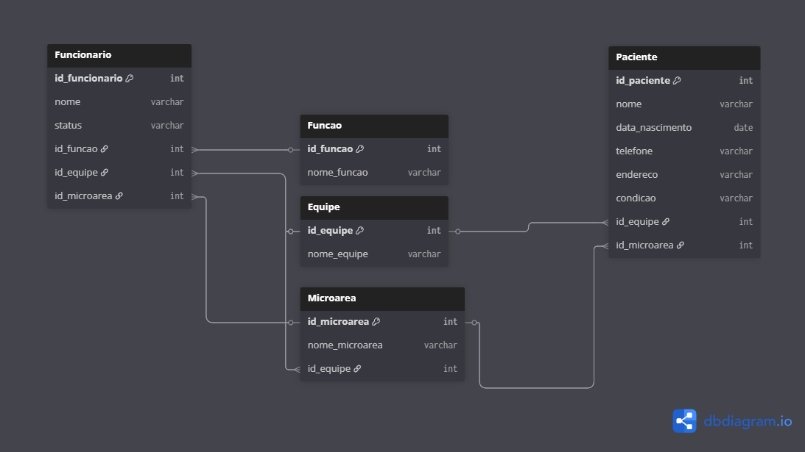

# monitoramento-esfs
Ferramenta automatizada em Google Sheets e Apps Script para monitoramento de indicadores das ESFs.
# Sistema de Monitoramento da ESF

Ferramenta automatizada desenvolvida com Google Sheets e Google Apps Script, voltada ao monitoramento de indicadores de saúde e acompanhamento de pacientes da Estratégia Saúde da Família (ESF).

## Estrutura do Projeto

· Planilha base em Google Sheets
· Scripts automatizados em Google Apps Script
· Integração com Power BI em execução

## Diagrama de Banco de Dados

O diagrama abaixo representa a estrutura lógica dos dados utilizados na ferramenta.

